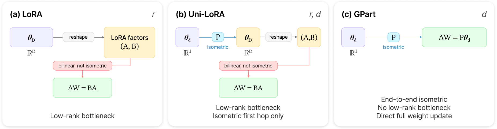
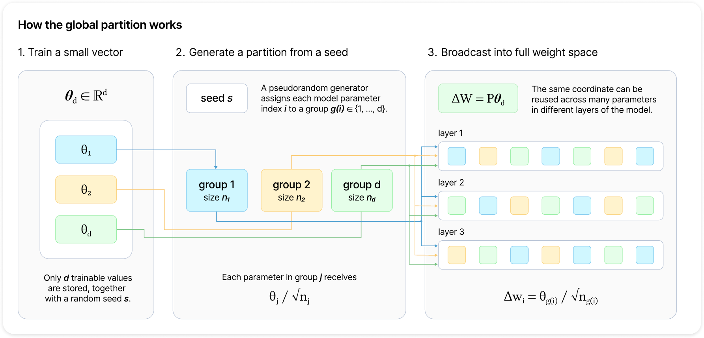

<div align="center">

# GPart
### End-to-End Isometric Fine-Tuning via Global Parameter Partitioning

[](https://arxiv.org/abs/2605.14841)
[](#installation)
[](https://www.apache.org/licenses/LICENSE-2.0)
[](#overview)

**Official implementation of the paper**  
**"GPart: End-to-End Isometric Fine-Tuning via Global Parameter Partitioning"**

**Authors:** [Paolo Mandica](https://paolomandica.github.io/), Michał Brzozowski, Zuzanna Dubanowska, Neo Christopher Chung  
Samsung AI Center, Warsaw, Poland

[Paper](https://arxiv.org/abs/2605.14841) •
[Installation](#installation) •
[Quick Start](#quick-start) •
[Citation](#citation)

</div>

> **GPart is implemented following the standard interface of the 🤗 Hugging Face Parameter-Efficient Fine-Tuning (PEFT) library and is fully compatible with PEFT.**

---

## Teaser

**GPart** is a parameter-efficient fine-tuning method that removes the low-rank bottleneck entirely.  
Instead of factorizing updates as in LoRA-style approaches, GPart optimizes a $d$-dimensional vector and maps it **directly** into the full model weight space through a single global partition generated from a random seed.



This yields a fine-tuning pipeline with:
- **End-to-end isometry** in the trainable subspace.
- **A single clean capacity hyperparameter**: `d`.
- **Minimal storage cost**: the trainable vector plus one seed.



---

## Table of contents

- [GPart](#gpart)
    - [End-to-End Isometric Fine-Tuning via Global Parameter Partitioning](#end-to-end-isometric-fine-tuning-via-global-parameter-partitioning)
  - [Teaser](#teaser)
  - [Table of contents](#table-of-contents)
  - [Overview](#overview)
  - [Why GPart](#why-gpart)
  - [Installation](#installation)
  - [Quick start](#quick-start)
    - [RoBERTa on GLUE](#roberta-on-glue)
    - [Configuration System](#configuration-system)
    - [ViT on vision benchmarks](#vit-on-vision-benchmarks)
    - [LLMs on MetaMathQA](#llms-on-metamathqa)
    - [Evaluation on GSM8K and MATH](#evaluation-on-gsm8k-and-math)
  - [Integrating GPart into Your Project](#integrating-gpart-into-your-project)
  - [Reproducibility](#reproducibility)
  - [Contributing](#contributing)
    - [Branch Protection](#branch-protection)
  - [Citation](#citation)
  - [License](#license)

---

## Overview

GPart is a parameter-efficient fine-tuning (**PEFT**) method introduced in the paper  
**“GPart: End-to-End Isometric Fine-Tuning via Global Parameter Partitioning.”**

The method is built on a simple idea: instead of constraining updates through a low-rank matrix parameterization, optimize a low-dimensional vector $\theta_d \in \mathbb{R}^d$ and map it directly into the full weight space using a global partition matrix $P$:

$$
  \Delta W = P\theta_d
$$

The paper motivates this formulation by arguing that low-rank adapters distort geometry through bilinear reconstruction, while GPart preserves distances in the trainable subspace and offers a cleaner parameterization for PEFT.

---

## Why GPart

Compared with low-rank PEFT methods, GPart is designed to be structurally simpler and more direct.

- **No low-rank bottleneck**: updates are not reconstructed through a bilinear factorization.
- **End-to-end isometric mapping**: the trainable subspace preserves Euclidean geometry.
- **Minimal state**: the adapter can be reconstructed from the trainable vector and a random seed.
- **One main capacity knob**: `d` controls the size of the trainable subspace.

This repository contains the code used to evaluate GPart on:
- **Natural language understanding** with RoBERTa on GLUE.
- **Computer vision** with ViT on multiple image classification benchmarks.
- **Mathematical reasoning** with decoder-only LLMs fine-tuned on MetaMathQA and evaluated on GSM8K and MATH.

---

## Installation

This repository uses [`uv`](https://github.com/astral-sh/uv) for dependency and environment management.

```bash
uv sync
source .venv/bin/activate
```

---

## Quick start

### RoBERTa on GLUE

```bash
# RoBERTa-base with GPart
python src/scripts/glue/finetune_roberta_glue.py --adapter_type gpart

# RoBERTa-large with GPart
python src/scripts/glue/finetune_roberta_glue.py --adapter_type gpart --model_size large

# Selected tasks with a fixed seed
python src/scripts/glue/finetune_roberta_glue.py \
  --adapter_type gpart \
  --tasks sst2 qnli \
  --seed 123

# Parameter count only
python src/scripts/glue/finetune_roberta_glue.py \
  --adapter_type gpart \
  --compute_params_only
```

**Command-Line Overrides**

Override default hyperparameters directly from the command line. Arguments after the main flags are captured as key-value pairs:

```bash
python src/scripts/glue/finetune_roberta_glue.py \
  --adapter_type gpart \
  adapter.d 16384 \
  adapter.isometric False \
  training.lr 0.001 \
  training.head_lr 0.002 \
  training.batch_size 16
```

**Aggregate Results**

```bash
python src/scripts/glue/collect_results_glue.py logs/roberta_glue_gpart
```

---

### Configuration System

This project uses a **dataclass-based configuration system** — no YAML files. All configs are Python dataclasses with type safety, IDE autocomplete, and a single source of truth. Adding a new field to any config class automatically propagates everywhere without manual updates.

#### Config Hierarchy

Values are resolved with the following precedence (later overrides earlier):

```
1. Dataclass defaults        ← Python default values in the dataclass definition
2. Adapter-specific configs  ← Pre-defined instances per adapter type (e.g., GPART_BASE_CONFIG)
3. Task-specific configs     ← Per-adapter, per-task overrides (e.g., epochs=60 for SST2)
4. Model-size configs        ← Large-model variants when --model_size large (e.g., GPART_LARGE_CONFIG)
5. CLI overrides              ← Key-value pairs after the main flags
```

#### Config Structure

The central object is `ExperimentConfig`, which composes three sub-configs:

```python
@dataclass
class ExperimentConfig:
    adapter: AdapterConfig        # Adapter hyperparameters (d, r, dropout, etc.)
    training: TrainingConfig      # Training hyperparameters (lr, batch_size, etc.)
    task_metadata: dict           # Dataset info, metrics, num_labels per task
    task_configs: dict            # Task-specific overrides per adapter
```

**TrainingConfig** controls the training loop:

| Field             | Default  | Description                                     |
| ----------------- | -------- | ----------------------------------------------- |
| `batch_size`      | `32`     | Training batch size                             |
| `max_seq_length`  | `512`    | Maximum sequence length                         |
| `weight_decay`    | `0.1`    | Weight decay for regularization                 |
| `warmup_ratio`    | `0.06`   | Fraction of steps for LR warmup                 |
| `model_selection` | `"best"` | Model selection strategy (see below)            |
| `lr`              | `1e-3`   | Base learning rate (overridden by task configs) |
| `head_lr`         | `1e-3`   | Learning rate for classifier head               |

**AdapterConfig** is the base class extended by each adapter type. Each subclass adds its own fields (e.g., `d` for GPart, `r` and `alpha` for LoRA). Fields are automatically included in logging and serialization — no manual listing needed.

**TaskConfig** provides per-task overrides that take precedence over training defaults:

| Field        | Description                             |
| ------------ | --------------------------------------- |
| `epochs`     | Number of training epochs for this task |
| `lr`         | Task-specific base learning rate        |
| `head_lr`    | Task-specific head learning rate        |
| `batch_size` | Task-specific batch size                |

#### Model Size Awareness

When you pass `--model_size large`, the system selects:

1. **Large adapter instance** — e.g., `GPART_LARGE_CONFIG` instead of `GPART_BASE_CONFIG`
2. **Large task configs** — e.g., `GPART_LARGE_TASK_CONFIGS` with different epochs/lrs (if defined)

#### Adding a New Adapter

1. **Create a config file** in `src/configs/adapter_configs/`:

```python
# src/configs/adapter_configs/my_adapter.py
from dataclasses import dataclass, field
from typing import Dict, List
from configs.base_config import AdapterConfig, TaskConfig

@dataclass
class MyAdapterConfig(AdapterConfig):
    type: str = "my_adapter"
    my_param: int = 42

MY_ADAPTER_BASE_CONFIG = MyAdapterConfig()
MY_ADAPTER_LARGE_CONFIG = MyAdapterConfig(my_param=84)
MY_ADAPTER_TASK_CONFIGS: Dict[str, TaskConfig] = { ... }
```

2. **Register it** in `src/configs/adapter_configs/__init__.py`:

```python
from .my_adapter import MyAdapterConfig, MY_ADAPTER_BASE_CONFIG, ...

ADAPTER_CONFIG_REGISTRY["my_adapter"] = {
    "config_class": MyAdapterConfig,
    "base": MY_ADAPTER_BASE_CONFIG,
    "large": MY_ADAPTER_LARGE_CONFIG,
    "task_configs": MY_ADAPTER_TASK_CONFIGS,
}
```

3. **It's ready** — `my_adapter` automatically appears in `--adapter_type` choices and `ALLOWED_ADAPTERS`.

#### Two Config Layers

The system has two separate configuration layers:

| Layer                 | Class                        | Purpose                                           |
| --------------------- | ---------------------------- | ------------------------------------------------- |
| **Experiment config** | `GPARTConfig(AdapterConfig)` | What experiment to run (defaults, task overrides) |
| **PEFT config**       | `GPartConfig(PeftConfig)`    | How to construct the adapter model                |

The `get_peft_config()` function in `src/utils/adapter_utils.py` bridges them — it renames fields (e.g., `dropout` → `gpart_dropout`), adds PEFT-specific fields, and constructs the `GPartConfig` object that `get_peft_model()` expects. This separation keeps the experiment system decoupled from PEFT library internals.

---

### ViT on vision benchmarks

Supported datasets:

- `cifar10`
- `cifar100`
- `fgvc`
- `flowers102`
- `eurosat`
- `resisc45`
- `oxfordpets`
- `standfordcars`
- `dtd`

#### Data preparation

All datasets are downloaded automatically by the finetuning script, **except `dtd`**, which must be manually downloaded from [the DTD website](https://www.robots.ox.ac.uk/~vgg/data/dtd/).

After downloading, extract the archive into the `data/` directory. The expected structure is:

```
data/
└── dtd/
    ├── images/
    ├── imdb/
    └── labels/
```

#### Run experiments

```bash
# ViT-Base on FGVC Aircraft
python src/scripts/vision/finetune_ViT.py --dataset fgvc --model_size base

# ViT-Large on CIFAR-100
python src/scripts/vision/finetune_ViT.py --dataset cifar100 --model_size large

# Custom optimization settings
python src/scripts/vision/finetune_ViT.py \
  --dataset flowers102 \
  --model_size base \
  --head_lr 5e-3 \
  --base_lr 6e-3 \
  --num_train_epochs 30
```

#### Aggregate multi-seed results:

```bash
python src/scripts/vision/collect_results_ViT.py
```

---

### LLMs on MetaMathQA

Supported base models include:

- `google/gemma-7b`
- `Qwen/Qwen2.5-0.5B`
- `Qwen/Qwen2.5-3B`
- `Qwen/Qwen2.5-7B`
- `meta-llama/Llama-3.1-8B`

```bash
# Qwen2.5-0.5B with GPart
python src/scripts/math/finetune_metamath.py \
  --model_name Qwen/Qwen2.5-0.5B \
  --adapter_type gpart \
  --d 131072

# Qwen2.5-7B with GPart
python src/scripts/math/finetune_metamath.py \
  --model_name Qwen/Qwen2.5-7B \
  --adapter_type gpart \
  --d 524288

# With custom training settings
python src/scripts/math/finetune_metamath.py \
  --model_name Qwen/Qwen2.5-0.5B \
  --adapter_type gpart \
  --d 131072 \
  --per_device_train_batch_size 2 \
  --gradient_accumulation_steps 8 \
  --learning_rate 2e-4
```

---

### Evaluation on GSM8K and MATH

```bash
# Base model
python src/scripts/math/eval_math.py \
  --model_path Qwen/Qwen2.5-0.5B \
  --dataset gsm8k

# GPart fine-tuned model
python src/scripts/math/eval_math.py \
  --model_path Qwen/Qwen2.5-0.5B \
  --adapter_path logs/metamath_qwen-qwen2.5-0.5b_gpart_d131072_drop0.05_lr0.0002_bs4_ga4_ep2_seq2048_nosysprompt_seed42_131k \
  --dataset math
```

---

## Integrating GPart into Your Project

To use GPart in your own repository, follow these steps:

#### Step 1: Copy the PEFT folder

Copy the `peft` folder from this repository into your project:

```bash
# From your project root
cp -r /path/to/GPart/peft .
```

#### Step 2: Configure uv for local PEFT

If you're using `uv` for dependency management, you can configure it to use the local PEFT copy instead of downloading from PyPI. Add the following to your `pyproject.toml`:

```toml
# Add peft to the dependencies
dependencies = [
  "peft"
]

# Add the peft local path as source
[tool.uv.sources]
peft = { path = "peft", editable = true }
```

This tells uv to use the local `peft` package from the specified path.

#### Step 3: Import and use GPart

Once the PEFT folder is in your project, you can use GPart just like any other PEFT adapter:

```python
import torch
from transformers import AutoModelForCausalLM
from peft import TaskType, get_peft_model
from peft.tuners.gpart import GPartConfig

# 1. Define the GPart adapter configuration
adapter_config = GPartConfig(
    d=131072,                        # Capacity parameter (adjust for your use case)
    target_modules=["q_proj", "v_proj"],  # Modules to adapt
    task_type=TaskType.CAUSAL_LM,    # Task type (CAUSAL_LM, SEQ_CLS, etc.)
)

# 2. Load your base model
model = AutoModelForCausalLM.from_pretrained(
    args.model_name,
    trust_remote_code=True,
    torch_dtype=torch_dtype,
)

# 3. Wrap the model with GPart adapter
model = get_peft_model(model, adapter_config)

# 4. Train as usual with your preferred training loop
#    The model now has GPart adapters injected and ready for training
```

---

## Reproducibility

For reproducible results:

- Run multiple seeds for each setting.
- Track the model checkpoint, task, and `d`.
- Preserve the random seed used for partition generation.
- Use the provided result collection scripts for final aggregation.

Because the GPart adapter is reconstructed from the trainable vector and the partition seed, **the seed is part of the effective model state**.

---

## Contributing

We welcome contributions! This repository uses a **fork-based workflow** — fork the repo, create a branch, and submit a pull request.

**Quick summary:**
1. **Fork** the repository
2. **Create a branch** in your fork for each feature/experiment
3. **Format your code** with [Black](https://github.com/psf/black) before submitting
4. **Submit a Pull Request** when you're ready to merge into `main`
5. **PR review required** — at least one approval before merging

See [CONTRIBUTING.md](CONTRIBUTING.md) for the complete guide including setup instructions, branch naming conventions, and PR templates.

### Branch Protection

The `main` branch is protected:
- ✅ No direct pushes — all changes via pull requests only
- ✅ At least 1 approving review required
- ✅ Branch must be up to date before merging
- ✅ No force pushes allowed

---

## Citation

If you use this repository in academic work, please cite:

```bibtex
@misc{mandica2026gpart,
      title={GPart: End-to-End Isometric Fine-Tuning via Global Parameter Partitioning}, 
      author={Paolo Mandica and Michał Brzozowski and Zuzanna Dubanowska and Neo Christopher Chung},
      year={2026},
      eprint={2605.14841},
      archivePrefix={arXiv},
      primaryClass={cs.LG},
      url={https://arxiv.org/abs/2605.14841}, 
}
```

---

## License

This project is licensed under the [Apache-2.0 License](LICENSE).
